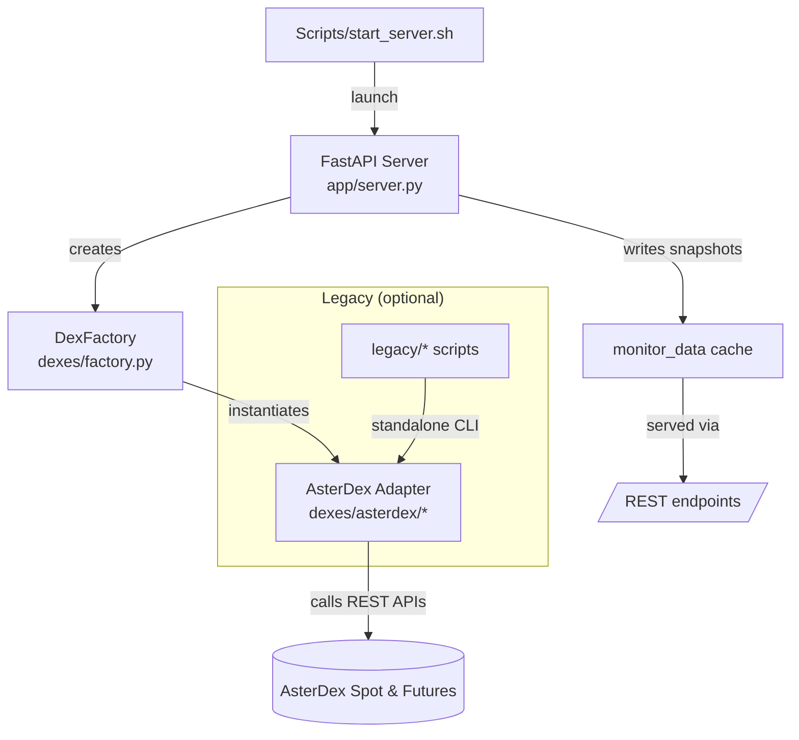

# Funding Rate Arbitrage Platform

Multi-DEX funding-fee arbitrage framework with a FastAPI control plane, modular exchange adapters, and real-time monitoring.

---

## 1. Overview

- **Language / Runtime**: Python 3.11 (managed with [uv](https://docs.astral.sh/uv/)).
- **Core entrypoint**: `app/server.py` (FastAPI application exposing REST endpoints to run/monitor bots).
- **Current DEX support**: AsterDex (spot + futures). Architecture prepared for additional integrations.
- **Legacy scripts**: Original single-DEX CLI tools preserved under `legacy/` (not part of the running server).

📚 Additional guides live under [`docs/`](docs/). The architecture diagram below is also available as a draw.io file at [`docs/architecture.drawio`](docs/architecture.drawio) for editing in diagrams.net.



---

## 2. Repository Layout

```
funding-rate-arb/
├── app/                 # FastAPI application (server + config facade)
│   ├── server.py        # REST API, bot orchestration, monitoring loop
│   └── config.py        # Environment/JSON backed configuration manager
├── dexes/               # Exchange adapters
│   ├── factory.py       # DexFactory - pluggable client/bot/monitor creation
│   ├── base/            # Abstract interfaces for new DEXes
│   └── asterdex/        # AsterDex client + funding bot + monitor
├── scripts/             # Operational helpers (start server, manage config)
├── samples/             # Example config/data (e.g. bot_config.json)
├── docs/                # Runbooks, comparisons, architecture diagram
├── legacy/              # Archived single-DEX CLI scripts (manual usage only)
├── tests/               # TDD scaffolding & smoke scripts
├── README.md            # You are here
└── pyproject.toml       # Project metadata & dependencies
```

---

## 3. Quick Start

1. **Clone the repo & enter the directory**
   ```bash
   git clone https://github.com/xxkhanxx77/funding-rate-arb.git
   cd funding-rate-arb
   ```
2. **Create your environment file**
   ```bash
   cp .env.example .env
   # edit .env and replace placeholder API credentials & parameters
   ```
3. **Install dependencies with uv**
   ```bash
   uv sync
   ```
4. **Launch the FastAPI server**
   ```bash
   ./scripts/start_server.sh
   # or: set -a; source .env; set +a
   #      uv run uvicorn app.server:app --host 0.0.0.0 --port 8000 --reload
   ```
5. **Visit the API docs** – http://0.0.0.0:8000/docs

Server logs emit a snapshot summary every `FUNDING_MONITOR_INTERVAL` seconds (default 60):

```
INFO:app.server:Snapshot ASTERDEX | Value $104.91 | PnL $-4.76 | Funding30d $0.37 |
                 APY 23.54% | LastRate 0.0215% | Next 2025-09-27T07:00:00
```

---

## 4. Configuration

### `.env` variables

| Variable                                   | Description                                                                |
| ------------------------------------------ | -------------------------------------------------------------------------- |
| `ASTERDEX_API_KEY` / `ASTERDEX_API_SECRET` | API key/secret for AsterDex spot & futures trading.                        |
| `FUNDING_DEX`                              | DEX identifier to use (`asterdex`).                                        |
| `FUNDING_CAPITAL`                          | Total quote capital (USDT) per bot run.                                    |
| `FUNDING_BATCH_QUOTE`                      | Quote size per batch order.                                                |
| `FUNDING_MODE`                             | Strategy direction (`buy_spot_short_futures` or `sell_spot_long_futures`). |
| `FUNDING_MONITOR_INTERVAL`                 | Seconds between background monitor refreshes (default 60).                 |
| `FUNDING_LOG_LEVEL`                        | Logging verbosity (`INFO`, `DEBUG`, ...).                                  |

### JSON configuration (optional legacy workflow)

`samples/bot_config.json` mirrors the same fields. The CLI helper `scripts/manage_config.py` can show/update these values:

```bash
uv run python scripts/manage_config.py show
uv run python scripts/manage_config.py update '{"capital": "200", "batch_quote": "20"}'
```

FastAPI always prioritises environment variables; JSON is preserved for compatibility with historical automation.

---

## 5. Monitoring & API Endpoints

| Endpoint                | Method | Description                                         |
| ----------------------- | ------ | --------------------------------------------------- |
| `/`                     | GET    | Basic metadata & supported DEXes                    |
| `/health`               | GET    | Heartbeat check                                     |
| `/dexes`                | GET    | List supported DEX identifiers                      |
| `/monitor/{dex}`        | GET    | JSON snapshot (portfolio, hedging, mark price, APY) |
| `/monitor/{dex}/simple` | GET    | Human-friendly text summary                         |
| `/apy/{dex}/simple`     | GET    | Funding APY analysis (7d/30d)                       |
| `/start`                | POST   | Launch funding bot job (see docs for payload)       |
| `/status/{job_id}`      | GET    | Job status                                          |
| `/result/{job_id}`      | GET    | Execution result once completed                     |

📈 **Funding APY calculation**: the mark-price monitor calls `/fapi/v1/premiumIndex` & `/fapi/v1/markPriceKlines`, then annualises the per-period rate as `rate * 3 (periods/day) * 365 * 100`. This matches the method described in the [AsterDex Futures API specification](https://github.com/asterdex/api-docs/blob/master/aster-finance-futures-api.md#symbol-order-book-ticker).

---

## 6. Extending to a New DEX

1. Create a new folder under `dexes/` (e.g. `dexes/hyperliquid/`).
2. Implement `client.py`, `funding_bot.py`, `monitor.py` using the abstract base interfaces in `dexes/base/dex_interface.py`.
3. Register the new classes in `dexes/factory.py` (`SUPPORTED_DEXES`).
4. Add environment variables `HYPERLIQUID_API_KEY` / `HYPERLIQUID_API_SECRET` (or equivalent).
5. Restart the server—no changes required elsewhere.

---

## 7. Legacy Scripts (Optional)

The original single-DEX CLIs live in `legacy/`. They do not affect the running API. Run them manually via module paths if needed:

```bash
uv run python -m legacy.small_capital_strategy --dry-run --capital 200 --batch-size 20
```

Use the new architecture for production workloads; legacy scripts remain for experimentation and reference.

---

## 8. Testing & Quality

- **Unit / Smoke tests:** `uv run pytest`
- **Type checking:** `uv run mypy .`
- **Lint & formatting:**
  ```bash
  uv run ruff check .
  uv run black .
  ```

The `tests/` directory currently contains smoke scripts targeting the legacy funding bot. Expand with FastAPI endpoint tests (e.g. using httpx/pytest-asyncio) as you iterate.

---

## 9. Deployment & GitHub Push

1. Add the remote if necessary: `git remote add origin https://github.com/xxkhanxx77/funding-rate-arb.git`
2. Review & stage changes: `git status`, `git add ...`
3. Commit: `git commit -m "feat: describe your change"`
4. Push: `git push origin main`

🚨 Never push `.env` or real API keys. `.gitignore` already excludes `.env` and common virtualenv/build artifacts.

---

## 10. Change Log / Review Notes

- Introduced modular FastAPI server with DexFactory pattern.
- Added mark-price polling to surface real-time funding APY in both logs and monitor responses.
- Structured repository documentation (`docs/`, draw.io diagram) and clarified `.env` workflow.
- Limited autoreload to active code paths, avoiding unnecessary restarts when editing legacy files.

---

## 11. References

- [AsterDex Futures API specification](https://github.com/asterdex/api-docs/blob/master/aster-finance-futures-api.md#symbol-order-book-ticker)
- [FastAPI documentation](https://fastapi.tiangolo.com/)
- [uv package/dependency manager](https://docs.astral.sh/uv/)

Happy funding! 🪙
